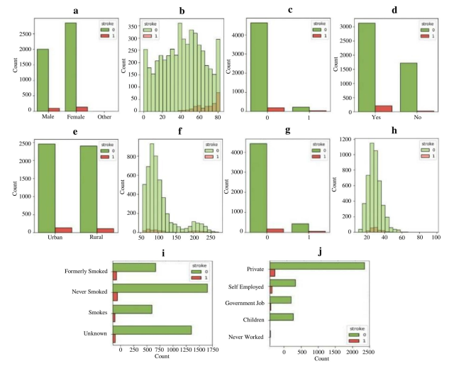

# Notes on project Week 6


## Features Correlation Matrix

Missing the Features Correlation Matrix, it is on the Page 6 of the paper.

Figure 4.  Features correlation heatmap for the dataset. Color intensity indicates the strength and direction of
correlations, aiding in the identification of potential patterns and dependencies in the data.

## Sparsity Matrix

Missing the Sparsity Matrix, it is on the Page 6 of the paper.

Figure 5.  Sparsity matrix for the dataset. The empty spaces found in the corresponding column signify the
presence of missing data values for the specific feature.


From the section 3.1 Visualizing Key Features


<!-- ADD FIGURE here -->

<!-- 

Figure 1.  Distribution of features concerning stroke occurrence. (a) through (j) present diverse aspects of
stroke occurrences, revealing nuanced patterns. (a) and (b) demonstrate gender and age-related trends. (c)
associates strokes with heart disease, while (d) suggests marital status correlations. (e) explores urban–rural
disparities. (f) and (g) show links to average glucose levels and hypertension. (h) relates BMI levels to stroke
incidence. (i) emphasizes the role of smoking history, and (j) explores potential occupational influences on
stroke likelihood. -->

<!-- ```{r}
#| code-fold: true
#| label: eda-plots
#| fig-cap: "Distribution of key features by stroke status."
#| fig-subcap: ["Age", "Average Glucose Level", "BMI", "Hypertension"]
#| layout-ncol: 2

# Using the MICE imputed dataset for visualizations
p1 <- ggplot(df_mice, aes(x = age, fill = factor(stroke))) + 
  geom_histogram(binwidth = 5, position = "identity", alpha = 0.6) +
  labs(title = "Stroke Cases by Age", x = "Age", y = "Count")

p2 <- ggplot(df_mice, aes(x = avg_glucose_level, fill = factor(stroke))) + 
  geom_histogram(binwidth = 10, position = "identity", alpha = 0.6) +
  labs(title = "Stroke Cases by Glucose Level", x = "Average Glucose Level", y = "Count")

p3 <- ggplot(df_mice, aes(x = bmi, fill = factor(stroke))) + 
  geom_histogram(binwidth = 2, position = "identity", alpha = 0.6) +
  labs(title = "Stroke Cases by BMI", x = "BMI", y = "Count")

p4 <- ggplot(df_mice, aes(x = factor(hypertension), fill = factor(stroke))) + 
  geom_bar(position = "dodge") +
  labs(title = "Stroke Cases by Hypertension", x = "Hypertension (0=No, 1=Yes)", y = "Count")

# Arrange plots
ggarrange(p1, p2, p3, p4, ncol = 2, nrow = 2, common.legend = TRUE, legend="bottom")
``` -->

